# 🌊 Water Intelligence Project - Defense Presentation Guide

> **A Comprehensive Guide for Project Defense and Team Understanding**
>
> This document explains the complete project from start to end, covering objectives, methodology, architecture, features, challenges, and future plans.

---

## 📋 Table of Contents

1. [Project Overview](#1-project-overview)
2. [Problem Statement & Objectives](#2-problem-statement--objectives)
3. [System Architecture](#3-system-architecture)
4. [Methodology](#4-methodology)
5. [Features Implemented](#5-features-implemented)
6. [Workflow Diagrams](#6-workflow-diagrams)
7. [Technology Stack](#7-technology-stack)
8. [Challenges Faced & Solutions](#8-challenges-faced--solutions)
9. [Work Completed](#9-work-completed)
10. [Tasks Remaining & Future Plans](#10-tasks-remaining--future-plans)
11. [How to Explain to Supervisor](#11-how-to-explain-to-supervisor)

---

## 1. Project Overview

### What is Water Intelligence Project?

The **Water Intelligence Project** is an AI-powered water quality monitoring and prediction system designed specifically for **aquaculture (fish farming)** operations. It uses machine learning and deep learning to:

- **Monitor** water quality parameters (pH, TDS) in real-time
- **Predict** water quality status (SAFE, STRESS, DANGER)
- **Forecast** future pH and TDS values using LSTM neural networks
- **Detect anomalies** before they become critical
- **Recommend** corrective actions through an AI assistant

### Why This Project?

In aquaculture, water quality directly affects fish health, growth, and survival. Poor water conditions lead to:

- Fish stress and disease
- Reduced growth rates
- Mass mortality events
- Economic losses

Traditional monitoring is **reactive** (problems detected after damage occurs). Our system is **proactive** (problems predicted before they occur).

---

## 2. Problem Statement & Objectives

### Problem Statement

> "How can we leverage AI and machine learning to transform aquaculture water quality management from reactive monitoring to proactive prediction, enabling fish farmers to prevent water quality issues before they affect fish health?"

### Primary Objectives

| #   | Objective                                                           | Status      |
| --- | ------------------------------------------------------------------- | ----------- |
| 1   | Develop a multi-class water quality classifier (SAFE/STRESS/DANGER) | ✅ Complete |
| 2   | Implement LSTM-based time-series forecasting for pH and TDS         | ✅ Complete |
| 3   | Build anomaly detection for early warning of unusual conditions     | ✅ Complete |
| 4   | Create virtual sensors to estimate missing parameters               | ✅ Complete |
| 5   | Develop an interactive web dashboard for visualization              | ✅ Complete |
| 6   | Integrate AI assistant for intelligent recommendations              | ✅ Complete |
| 7   | Ensure system is deployable via Docker                              | ✅ Complete |

### Secondary Objectives

| #   | Objective                                            | Status      |
| --- | ---------------------------------------------------- | ----------- |
| 1   | Generate realistic synthetic data for model training | ✅ Complete |
| 2   | Implement comprehensive API with REST endpoints      | ✅ Complete |
| 3   | Add PDF report generation capability                 | ✅ Complete |
| 4   | Create sensor health monitoring dashboard            | ✅ Complete |
| 5   | Support dark mode and keyboard shortcuts             | ✅ Complete |

---

## 3. System Architecture

### High-Level Architecture

```mermaid
graph TB
    subgraph "Data Layer"
        A[📊 Sensor Data<br/>pH, TDS, Temperature] --> B[📁 Data Storage<br/>CSV Files]
    end

    subgraph "ML/DL Layer"
        B --> C[🔄 Data Preprocessing<br/>Cleaning, Feature Engineering]
        C --> D[🧠 Model Training<br/>RF, LSTM, Isolation Forest]
        D --> E[💾 Trained Models<br/>.joblib, .pth files]
    end

    subgraph "Backend Layer"
        E --> F[⚡ FastAPI Server<br/>REST API Endpoints]
        F --> G[🔌 API Routes<br/>/predict, /forecast, /chat]
    end

    subgraph "Frontend Layer"
        G --> H[🖥️ Web Dashboard<br/>HTML, TailwindCSS, Chart.js]
        H --> I[👤 User Interface<br/>Predictions, Charts, Reports]
    end

    subgraph "AI Layer"
        J[🤖 LangGraph + Gemini<br/>AI Assistant] --> G
    end

    style A fill:#e3f2fd
    style D fill:#fff3e0
    style F fill:#e8f5e9
    style H fill:#fce4ec
    style J fill:#f3e5f5
```



### Component Interaction Flow

```mermaid
sequenceDiagram
    participant U as 👤 User
    participant D as 🖥️ Dashboard
    participant A as ⚡ FastAPI
    participant M as 🧠 ML Models
    participant AI as 🤖 AquaBot

    U->>D: Enter pH=7.2, TDS=350
    D->>A: POST /api/predict
    A->>M: Load & Run Models
    M-->>A: Prediction Results
    A-->>D: JSON Response
    D-->>U: Display: SAFE ✅

    U->>D: Ask "What should I do?"
    D->>A: POST /api/chat
    A->>AI: Process with Context
    AI-->>A: AI Response
    A-->>D: Recommendations
    D-->>U: Show AI Advice
```



---

## 4. Methodology

### Development Methodology: Agile + Iterative

We followed an **iterative development approach** with the following phases:

```mermaid
graph LR
    A[📋 Requirements<br/>Analysis] --> B[🎨 Design<br/>Architecture]
    B --> C[💻 Implementation<br/>Development]
    C --> D[🧪 Testing<br/>Validation]
    D --> E[🚀 Deployment<br/>Docker]
    E --> F[📈 Evaluation<br/>Feedback]
    F --> A

    style A fill:#bbdefb
    style B fill:#c8e6c9
    style C fill:#fff9c4
    style D fill:#ffccbc
    style E fill:#d1c4e9
    style F fill:#f8bbd9
```



### Machine Learning Methodology

```mermaid
flowchart TD
    subgraph "Data Pipeline"
        A1[Generate Synthetic Data] --> A2[Data Cleaning]
        A2 --> A3[Feature Engineering]
        A3 --> A4[Train/Test Split]
    end

    subgraph "Model Training"
        A4 --> B1[Random Forest Classifier]
        A4 --> B2[LSTM Forecasters]
        A4 --> B3[Isolation Forest]
        A4 --> B4[Virtual Sensor Regressors]
    end

    subgraph "Model Evaluation"
        B1 --> C1[Accuracy, F1-Score]
        B2 --> C2[MAE, MSE]
        B3 --> C3[Precision, Recall]
        B4 --> C4[R², RMSE]
    end

    subgraph "Deployment"
        C1 --> D1[Save Models]
        C2 --> D1
        C3 --> D1
        C4 --> D1
        D1 --> D2[API Integration]
        D2 --> D3[Dashboard]
    end
```



### LSTM Architecture for Time-Series Forecasting


---

## 5. Features Implemented

### Core Features (10 Major Tasks)


### Feature Details

| Feature                    | Description                                 | Technology         |
| -------------------------- | ------------------------------------------- | ------------------ |
| **3-Class Classification** | Predicts SAFE/STRESS/DANGER with confidence | Random Forest      |
| **LSTM Forecasting**       | Predicts future pH/TDS values               | PyTorch LSTM       |
| **Anomaly Detection**      | Identifies unusual readings                 | Isolation Forest   |
| **Virtual Sensors**        | Estimates DO, Temp, Turbidity               | RF Regressors      |
| **AI Parameter Simulator** | What-if scenario testing                    | Frontend Logic     |
| **Sensor Health Monitor**  | Tracks sensor status & drift                | API + Dashboard    |
| **Event Timeline**         | Chronological event log                     | Local Storage      |
| **AI Assistant (AquaBot)** | Natural language Q&A                        | LangGraph + Gemini |
| **Voice Input**            | Speak to AquaBot                            | Web Speech API     |
| **PDF Reports**            | Downloadable analysis                       | ReportLab          |

### Dashboard Tabs

```mermaid
graph LR
    subgraph "Dashboard Navigation"
        T1[📊 Predict] --> T2[📈 Forecast]
        T2 --> T3[🔧 Sensors]
        T3 --> T4[🤖 Assistant]
        T4 --> T5[📋 Events]
        T5 --> T6[📄 Reports]
    end

    T1 --- F1[Input Form<br/>pH, TDS Entry]
    T1 --- F2[Prediction Results<br/>Classification Display]
    T1 --- F3[Virtual Sensors<br/>DO, Temp, Turbidity]

    T2 --- F4[LSTM Chart<br/>Historical + Forecast]
    T2 --- F5[Anomaly Timeline<br/>Scatter Plot]
    T2 --- F6[Risk Heatmap<br/>24x7 Grid]

    T3 --- F7[Sensor Status<br/>Online/Offline]
    T3 --- F8[Drift Trend<br/>Calibration]

    T4 --- F9[Chat Interface<br/>AI Responses]
    T4 --- F10[Voice Input<br/>Microphone]
```



---

## 6. Workflow Diagrams

### Complete Data Flow

```mermaid
flowchart TD
    subgraph "Input Sources"
        S1[🔬 pH Sensor]
        S2[🔬 TDS Sensor]
        S3[📝 Manual Input]
    end

    subgraph "Data Processing"
        S1 --> P1[Timestamp Extraction]
        S2 --> P1
        S3 --> P1
        P1 --> P2[Feature Engineering]
        P2 --> P3[Rolling Averages<br/>Hour Sin/Cos]
    end

    subgraph "ML Inference"
        P3 --> M1{Classifier}
        P3 --> M2{Anomaly Detector}
        P3 --> M3{Virtual Sensors}
        P3 --> M4{LSTM Forecaster}

        M1 --> R1[Label: SAFE/STRESS/DANGER]
        M2 --> R2[Is Anomaly: Yes/No]
        M3 --> R3[DO, Temp, Turbidity]
        M4 --> R4[Future pH, TDS]
    end

    subgraph "Recommendation Engine"
        R1 --> RE[Generate Recommendations]
        R2 --> RE
        RE --> RO[Actionable Advice]
    end

    subgraph "Output"
        R1 --> O1[Dashboard Display]
        R2 --> O1
        R3 --> O1
        R4 --> O1
        RO --> O1
        O1 --> O2[PDF Report]
        O1 --> O3[Event Log]
    end

    style M1 fill:#fff3e0
    style M2 fill:#fff3e0
    style M3 fill:#fff3e0
    style M4 fill:#fff3e0
```



### API Request Flow


### LSTM Forecasting Flow


### User Interaction Flow


---

## 7. Technology Stack

### Complete Technology Map


### Technology Justification

| Technology       | Why Chosen                                         |
| ---------------- | -------------------------------------------------- |
| **FastAPI**      | Async support, automatic docs, Pydantic validation |
| **PyTorch**      | Flexible LSTM implementation, strong community     |
| **scikit-learn** | Reliable classical ML, easy to use                 |
| **LangGraph**    | Stateful AI agents with conversation memory        |
| **Chart.js**     | Interactive, responsive charts, easy customization |
| **TailwindCSS**  | Utility-first, rapid UI development                |
| **Docker**       | Consistent deployment across environments          |

---

## 8. Challenges Faced & Solutions

### Technical Challenges


### Challenges Summary Table

| #   | Challenge                  | Description                                | Solution                                                  | Outcome                       |
| --- | -------------------------- | ------------------------------------------ | --------------------------------------------------------- | ----------------------------- |
| 1   | Model Accuracy             | Initial classifier had ~75% accuracy       | Feature engineering (rolling averages, temporal features) | Achieved ~95% accuracy        |
| 2   | LSTM Overfitting           | Small dataset caused overfitting           | Dropout, early stopping, data augmentation                | Stable multi-step forecasting |
| 3   | Chart Synchronization      | Fullscreen chart not copying correctly     | Deep clone with proper axis configuration                 | Exact chart replication       |
| 4   | Quick Scenario Calibration | Test values not matching model predictions | Analyzed training data distribution, calibrated values    | Accurate quick tests          |
| 5   | AI Context Awareness       | Assistant gave generic responses           | Passed prediction context, implemented memory             | Personalized recommendations  |
| 6   | Docker Deployment          | Package conflicts in container             | Multi-stage build, production requirements                | Clean containerization        |
| 7   | Dual Y-Axis Charts         | pH and TDS have different scales           | Configured Chart.js with two Y-axes                       | Proper visualization          |
| 8   | Virtual Sensor Accuracy    | Initial estimates were off                 | Trained on correlated synthetic data                      | Reasonable approximations     |

---

## 9. Work Completed

### Development Timeline


### Completed Tasks Checklist

#### Backend (100% Complete)

- [x] FastAPI application setup
- [x] CORS configuration
- [x] Pydantic request/response models
- [x] Health check endpoint
- [x] Model loading on startup
- [x] Prediction endpoint with classification
- [x] Anomaly detection integration
- [x] Virtual sensor predictions
- [x] Recommendation engine
- [x] Random Forest forecasting endpoint
- [x] LSTM forecasting endpoint
- [x] AI chat endpoint with LangGraph
- [x] PDF report generation
- [x] Sensor health endpoint

#### Frontend (100% Complete)

- [x] Responsive dashboard layout
- [x] 6-tab navigation system
- [x] Prediction input form
- [x] Results display with confidence
- [x] LSTM forecast chart
- [x] Anomaly timeline visualization
- [x] Risk heatmap
- [x] Sensor health monitoring
- [x] AI chat interface
- [x] Voice input support
- [x] Event timeline
- [x] PDF download
- [x] Dark mode toggle
- [x] Keyboard shortcuts
- [x] Quick scenario buttons
- [x] Water quality gauge
- [x] Live statistics
- [x] Connection status indicator
- [x] Chart fullscreen mode
- [x] Data comparison card

#### ML/DL Models (100% Complete)

- [x] Synthetic data generation script
- [x] Data cleaning pipeline
- [x] Feature engineering
- [x] Random Forest classifier
- [x] LSTM pH forecaster
- [x] LSTM TDS forecaster
- [x] Isolation Forest anomaly detector
- [x] Virtual sensor regressors (DO, Temp, Turbidity)
- [x] Model cards with metadata
- [x] Metrics logging

#### DevOps (100% Complete)

- [x] Dockerfile (multi-stage build)
- [x] docker-compose.yml
- [x] .dockerignore
- [x] Requirements management
- [x] Environment variable support
- [x] GitHub Actions CI (if using)

---

## 10. Tasks Remaining & Future Plans

### Immediate Future Work

```mermaid
graph TD
    subgraph "Short-term (1-2 months)"
        ST1[🔌 Real Sensor Integration<br/>Arduino/Raspberry Pi]
        ST2[📱 Mobile App<br/>React Native]
        ST3[📧 Alert System<br/>Email/SMS Notifications]
    end

    subgraph "Medium-term (3-6 months)"
        MT1[👥 Multi-tenant Support<br/>Multiple Farms]
        MT2[🌦️ Weather Integration<br/>External APIs]
        MT3[📊 Historical Analytics<br/>Trend Analysis]
    end

    subgraph "Long-term (6-12 months)"
        LT1[🔄 Auto Model Retraining<br/>MLOps Pipeline]
        LT2[🤖 Edge Deployment<br/>On-device Inference]
        LT3[🌍 Cloud Deployment<br/>AWS/GCP/Azure]
    end

    ST1 --> MT1
    ST2 --> MT1
    ST3 --> MT2
    MT1 --> LT1
    MT2 --> LT2
    MT3 --> LT3
```



### Future Enhancement Details

| Priority  | Enhancement             | Description                                     | Complexity |
| --------- | ----------------------- | ----------------------------------------------- | ---------- |
| 🔴 High   | Real Sensor Integration | Connect Arduino/Raspberry Pi sensors            | Medium     |
| 🔴 High   | Mobile Application      | React Native app for on-the-go monitoring       | High       |
| 🟡 Medium | Email/SMS Alerts        | Automated notifications for critical conditions | Low        |
| 🟡 Medium | Multi-farm Support      | Manage multiple aquaculture sites               | High       |
| 🟡 Medium | Weather API Integration | Correlate with weather conditions               | Low        |
| 🟢 Low    | Auto Model Retraining   | Continuous learning from new data               | High       |
| 🟢 Low    | Edge Deployment         | Run models on edge devices                      | Medium     |
| 🟢 Low    | Cloud Deployment        | Scale to cloud infrastructure                   | Medium     |

---

## 11. How to Explain to Supervisor

### Elevator Pitch (30 seconds)

> "We built an AI-powered water quality monitoring system for fish farming. It uses machine learning to classify water conditions as SAFE, STRESS, or DANGER, and LSTM neural networks to forecast future pH and TDS values. The system includes a web dashboard with real-time predictions, an AI chatbot for recommendations, and can be deployed anywhere using Docker."

### Key Points to Emphasize

1. **Problem Relevance**

   - Water quality is critical in aquaculture
   - Traditional monitoring is reactive
   - Our solution is proactive and predictive

2. **Technical Innovation**

   - Multiple ML/DL techniques (classification, forecasting, anomaly detection)
   - LangGraph + Gemini AI integration
   - Full-stack implementation

3. **Practical Value**

   - Ready-to-use web dashboard
   - Docker deployment for easy installation
   - Comprehensive visualization

4. **Methodology**
   - Followed iterative development
   - Comprehensive testing
   - Clean architecture

### Questions Supervisor Might Ask

| Question                          | Answer                                                                                              |
| --------------------------------- | --------------------------------------------------------------------------------------------------- |
| "Why synthetic data?"             | Real sensor data wasn't available; synthetic data mimics realistic patterns                         |
| "How accurate is the model?"      | Classifier: ~95% accuracy; LSTM MAE: ~0.08 for pH, ~12.5 for TDS                                    |
| "Can it work with real sensors?"  | Yes, API accepts any data source; real sensor integration is future work                            |
| "Why these specific models?"      | RF for reliability, LSTM for sequence modeling, Isolation Forest for unsupervised anomaly detection |
| "How does the AI assistant work?" | LangGraph creates a stateful agent with Google Gemini, maintaining conversation context             |
| "What were the main challenges?"  | Model accuracy, LSTM overfitting, chart synchronization, AI context-awareness                       |

---

## Appendix: Quick Reference

### Running the Project

```bash
# Docker (Easiest)
docker-compose up --build
# Open: http://localhost:8000/static/index.html

# Manual
cd src/backend
uvicorn main:app --reload --port 8000
```

### Key Files

| File                                | Purpose                |
| ----------------------------------- | ---------------------- |
| `src/backend/main.py`               | FastAPI application    |
| `src/backend/model_utils.py`        | ML model utilities     |
| `src/backend/lstm_utils_pytorch.py` | LSTM inference         |
| `src/backend/routes/generative.py`  | AI assistant & reports |
| `src/backend/static/index.html`     | Dashboard UI           |
| `src/backend/static/js/app.js`      | Frontend logic         |
| `scripts/train_all_models.py`       | Model training         |
| `scripts/train_lstm_pytorch.py`     | LSTM training          |

### API Quick Reference

| Endpoint             | Method | Description     |
| -------------------- | ------ | --------------- |
| `/api/health`        | GET    | Health check    |
| `/api/predict`       | POST   | Main prediction |
| `/api/forecast_lstm` | POST   | LSTM forecast   |
| `/api/chat`          | POST   | AI assistant    |
| `/api/sensor_health` | GET    | Sensor status   |

---

_Document prepared for project defense - Water Intelligence Project_
